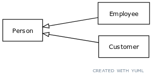

# The hand-written UML class diagram data set
The hand-written class diagram data set comes from Song Yang, who is a master's student in computer science.

Inspirations include the [yuml examples page](https://yuml.me/diagram/scruffy/class/samples).

The project report is available in this repo's PDF, called [**Extraction of UML class diagrams from English.pdf**](https://github.com/XsongyangX/UML-hand-class-diagrams/blob/6b961c6b19d383e2b443ab04ab1260f4fb0583b4/Extraction%20of%20UML%20class%20diagrams%20from%20English.pdf). Check it out! It's written like a research publication.

## Description
The train-test-validation split is 60-20-20. The data comes in pairs: `.txt` in English and class diagrams in [yuml](https://github.com/jaime-olivares/yuml-diagram/wiki) in `.yuml`. yUML is a textual representation of UML diagrams, e.g. the LaTex of UML.

### Sample: train/inheritance_person
The text is written in English.
> An employee is a person. A customer is a person.

There is the associated `.yuml`.
``` 
[Person]^-[Employee]
[Person]^-[Customer]
```

To visualize the `.yuml` files, you need the yuml command-line tool on [GitHub](https://github.com/wandernauta/yuml). After installing, you can simply call the `render.sh` script.

```bash
./render.sh train/inheritance_person.yml # generates last_render.png
```


> Note: Internet connection is required to generate pictures with yUML.

## Installation
The data set itself does not require installation. However, the processing tools do.

### YUML visualizer
As mentioned earlier, YUML is a UML visualization tool that produces images from text. Visit and install the yuml command-line tool on its [GitHub](https://github.com/wandernauta/yuml).

### Tokenizer
The YUML textual data has a structure similar to LaTex in concept. It is meant to compile symbols into shapes on an image. Because YUML is a domain specific language and not prose (English sentences), it requires a special tokenizer in preparation for NLP tasks.

The tokenizer is written in **C and Flex/Bison**. In order to build the tokenizer, you need to install Flex and Bison on your system. Naturally, this requires a C compiler and CMake.

#### Build script
The `build.sh` script inside `tokenizer` will create a build directory and run Make and CMake.
```bash
cd tokenizer
./build.sh
```
Alternatively, you can use the Makefile inside the `tokenizer` directory to generate all the C files from Flex/Bison. And launch CMake from a directory of your choice to compile C.

## Execution

### Rendering a YUML file
A provided bash script called `render.sh` helps with rendering YUML, described in Sample: train/inheritance_person.

### Running the tokenizer
After compilation, the tokenizer is located inside the `tokenizer/build` folder. The executable is named `yuml_tokenizer.exe`. The extension may vary depending on your operating system.

**ATTENTION**: The executable relies on dynamically linked libraries (Flex/Bison), that differs from platform to platform. If you compiled it with Cygwin, you can only run it on Cygwin.

As with any Flex/Bison executable, its default behavior is to take inputs from either STDIN or user prompts.
```bash
./yuml_tokenizer.exe < example.yuml # example.yuml contains your YUML
echo "[Student]" | ./yuml_tokenizer.exe
```
The echo command chain yields `[ Student ]`. The tokenizer is spacing out the different YUML syntax and standardizing alternate constructions.

#### Tokenize script
To simplify things, `tokenize.sh` calls the executable for you, assuming an `.exe` extension. All the data set will be tokenized and stored at the indicated folder.
```bash
./tokenize.sh my-tokenized-data-folder/
```

## Testing, quality assurance
Conveniently, the accompanying data set serves also as a test suite for the tokenizer. The `test.sh` comprehensively runs the tokenizer over the entire data set and checks whether it is working properly.

Tests include grammar, spacing out YUML and semantics. The latter makes running the tests take at least 10 minutes and requires Internet connection, since it is using `yuml`. As such, semantic testing is in a separate script called `test-semantics.sh`. You must run `test.sh` successfully before doing semantic testing.

# Known bugs
## Class with an interface
When a class name contains an interface, the semi-colon separating the brackets from the name of the class may hide the name of the class.
```
[ << IResizeable >> ; Shape ]
```
This will produce only a box with `IResizeable`. But if you remove the semi-colon, the box will contain both words.
